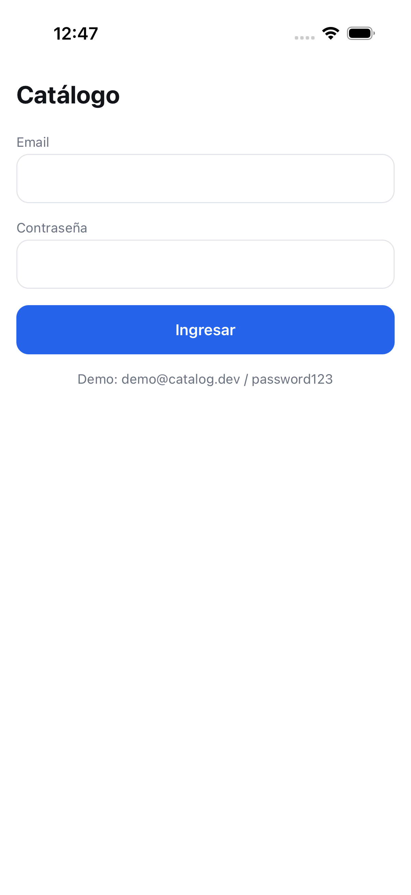
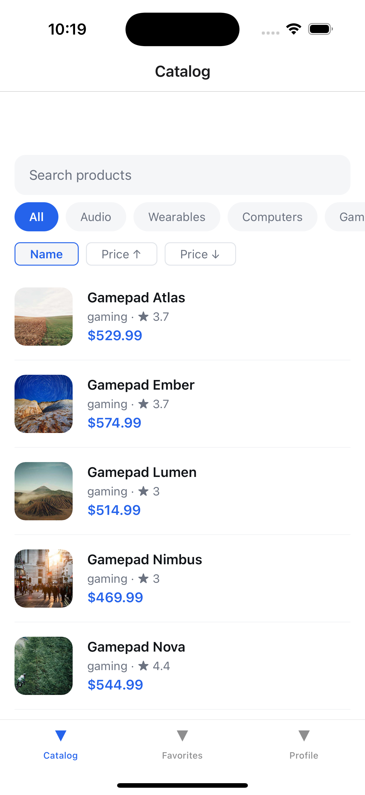
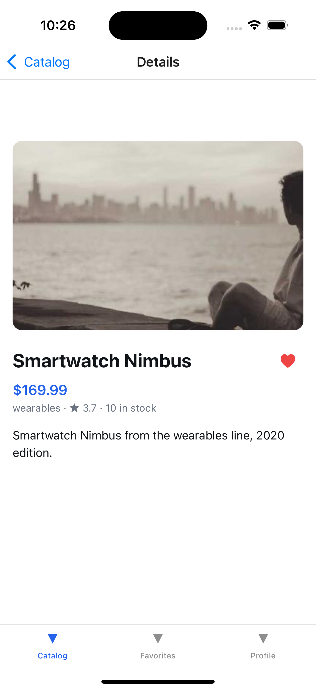
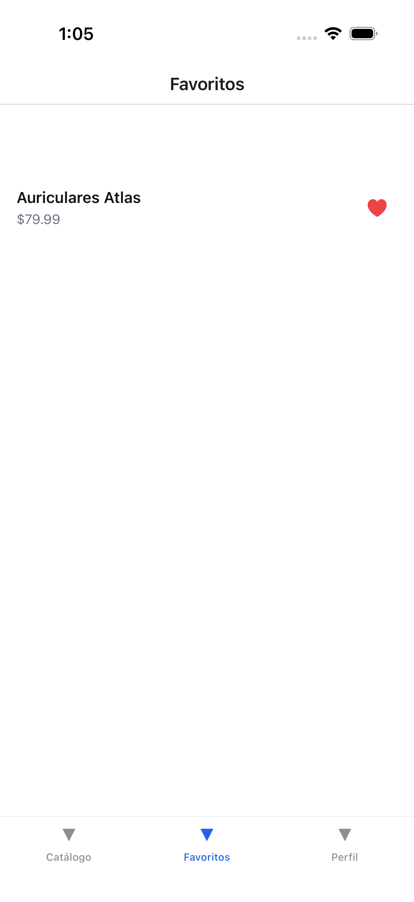
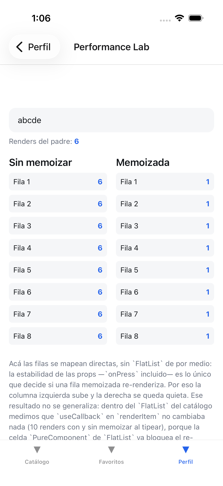

# rn-product-catalog


## Qué es

Un catálogo de productos en React Native (CLI bare, sin Expo): login, lista con búsqueda,
filtros, orden y paginado infinito, detalle de producto, favoritos persistidos y una pantalla de
perfil con un laboratorio de performance que mide memoización en vivo. No hay backend real: un
mock server en memoria (MSW) sirve los mismos handlers en desarrollo y en los tests.

Está construido como pieza de portfolio para conversaciones técnicas de React Native: cada
decisión de arquitectura, memoización o tradeoff está pensada para poder explicarse en voz alta y
señalarse en un archivo concreto, no solo describirse en abstracto. Este documento y `CLAUDE.md`
son el mapa para hacer eso.

## Setup desde clon limpio

Requisitos: Node ≥ 22.11 (ver `engines` en `package.json`; CI corre en Node 22 — el desarrollo
local se probó también en Node 20.19, con warnings de `engines` pero sin fallas), JDK 17 para
Android, Xcode reciente para iOS.

```bash
npm ci
cd ios && pod install && cd ..

npm run ios       # o: npm run android
```

`npm run lint`, `npm run typecheck` y `npm test -- --coverage` son los tres comandos que corre CI;
deberían pasar en verde sin ningún paso manual además de los de arriba.

**Solo iOS fue verificado corriendo nativamente en esta máquina** (no hay `ANDROID_HOME`
configurado). El código de Android no tiene ninguna rama distinta de la de iOS — mismo JS, mismo
bridge de New Architecture — pero el build de Android en sí no se ejecutó ni se vio correr en un
emulador.

## Credenciales de demo

```
demo@catalog.dev / password123
```

Están fijadas en `src/features/auth/demoCredentials.ts` (usadas por la UI, bajo `__DEV__`) y en
`src/mocks/db.ts` (usadas por el mock server). Un test (`demoCredentials.test.ts`) compara ambos
archivos para que no diverjan — son dos copias a propósito, no un import compartido; ver ADR-005
y la nota de "Aislamiento de mocks" más abajo.

## Capturas

| Login                                | Catálogo                                  | Detalle                                 |
| ------------------------------------ | ----------------------------------------- | --------------------------------------- |
|  |  |  |

| Favoritos                                    | Performance Lab                                          |
| -------------------------------------------- | -------------------------------------------------------- |
|  |  |

La del Performance Lab es la más útil para leer: se tipearon 5 caracteres en el campo de arriba y
quedó **"Renders del padre: 6"** (1 render inicial + 5 por cada tecla). La columna **Sin
memoizar** subió a 6 en las 8 filas; la columna **Memoizada** se quedó en 1 en las 8. Mismo padre
re-renderizando 6 veces, resultado opuesto según si la fila está memoizada y recibe props
estables. Verificado en vivo en simulador, no solo en el test unitario de la pantalla.

También se verificó en simulador, además de en los tests: el catálogo carga mostrando su
skeleton antes de tener datos; la búsqueda filtra la lista tecla por tecla con debounce (tipear
"atlas" deja solo "Auriculares Atlas", "Gamepad Atlas" y "Lámpara Atlas" visibles); hacer scroll
hasta el final de la lista trae más páginas — el catálogo completo excede una sola página y se
lo comprobó llegando a productos "Smartwatch" muy por debajo alfabéticamente de los primeros
"Auriculares"; y favoritos resuelve desde el cache de RTK Query, sin request nuevo, cuando el
producto ya se vio en la lista. El gesto de pull-to-refresh se ejecutó sin errores ni cuelgues,
pero como los datos del mock son estáticos, la captura de pantalla no puede distinguir
visualmente un refetch exitoso de un no-op; ese camino queda cubierto por el test de integración
de `ProductListScreen`, que sí puede afirmar sobre el número de requests.

## Notas de entrevista

Cada fila apunta a un archivo real del repo.

| Tema                               | Dónde está                                                                        | Respuesta corta                                                                                                                                                                                                                                                                                                                                                                                                                                                                                                                                                                              |
| ---------------------------------- | --------------------------------------------------------------------------------- | -------------------------------------------------------------------------------------------------------------------------------------------------------------------------------------------------------------------------------------------------------------------------------------------------------------------------------------------------------------------------------------------------------------------------------------------------------------------------------------------------------------------------------------------------------------------------------------------- |
| New Architecture                   | `android/gradle.properties`, `ios/Podfile`                                        | Fabric + TurboModules activos por defecto desde RN 0.76 (acá, RN 0.87.1). Renderer en C++, sin el bridge asíncrono clásico.                                                                                                                                                                                                                                                                                                                                                                                                                                                                  |
| Memoización nivel 1                | `src/features/catalog/screens/ProductListScreen.tsx`                              | Medido, no asumido: dentro de `FlatList`, `useCallback` en `renderItem` no cambia cuántas veces renderiza `ProductCard` (10 renders con y sin memoizar al tipear en el buscador; 0 y 0 forzando re-renders del padre sin cambiar datos). La razón es que `FlatList` ya envuelve cada fila en un `CellRenderer` que es `PureComponent`. Lo que sí sostiene la memoización es que `onPressProduct` esté memoizado, manteniendo estables las props de la fila; el `useCallback` en `renderItem` se conserva por otra razón, más acotada: evita re-renderizar los wrappers internos de la lista. |
| Memoización nivel 2                | `src/features/catalog/selectors.ts`                                               | Los dos lados de la misma regla, en un archivo: `selectProductsQueryArgs` arma un objeto nuevo y va con `createSelector`, porque sin él la identidad cambia en cada llamada y dispara un re-render por dispatch tenga o no relación el cambio. `selectHasActiveFilters`, al lado, devuelve un boolean y **no** se memoiza: `useSelector` compara con `===` y un primitivo no cambia de identidad sin cambiar de valor. Lo que decide no es que el selector sea derivado, es si devuelve una referencia nueva (mismo criterio en `src/services/favorites/selectors.ts`).                      |
| Memoización nivel 3                | `src/features/profile/screens/PerformanceLabScreen.tsx`                           | Sin `FlatList` de por medio, mapeando filas directas, la estabilidad de props sí decide todo: la columna sin memoizar sube a la par del padre, la memoizada se queda quieta. Es el contraste que muestra por qué el resultado del nivel 1 no se generaliza a cualquier lista.                                                                                                                                                                                                                                                                                                                |
| Cuándo NO memoizar                 | `src/features/catalog/screens/ProductDetailScreen.tsx`                            | Un cálculo barato (una comparación y una concatenación sobre datos ya en memoria) queda deliberadamente sin `useMemo`, con un comentario que explica el motivo estructural sin inventar una medición que no se hizo.                                                                                                                                                                                                                                                                                                                                                                         |
| Custom hook con cleanup            | `src/features/catalog/hooks/useDebouncedValue.ts`                                 | El `return` del `useEffect` cancela el timer pendiente; sin él, cada tecla dejaría un timer colgado corriendo después de que el valor ya cambió de nuevo.                                                                                                                                                                                                                                                                                                                                                                                                                                    |
| RTK Query vs. Context              | `src/services/api/baseApi.ts`, `src/features/catalog/catalogApi.ts`               | Cache, tags, deduplicación de requests y estados de carga (`isLoading`/`isFetching`/`error`) vienen gratis. Context no es un sistema de cache: sin esto habría que reimplementar todo eso a mano.                                                                                                                                                                                                                                                                                                                                                                                            |
| Estado servidor vs. cliente        | `src/features/catalog/catalogSlice.ts`                                            | El slice guarda la búsqueda, la categoría y el orden elegidos — nunca productos. Los productos viven solo en el cache de RTK Query.                                                                                                                                                                                                                                                                                                                                                                                                                                                          |
| Paginado infinito                  | `src/features/catalog/catalogApi.ts`                                              | `infiniteQuery` con cursor; `getNextPageParam` devuelve `undefined` cuando no hay más páginas, que es la señal que corta el scroll infinito.                                                                                                                                                                                                                                                                                                                                                                                                                                                 |
| Navegación tipada                  | `src/navigation/types.ts`                                                         | Un `ParamList` por navigator más un `declare global` que amplía `ReactNavigation.RootParamList`, así `navigation.navigate` tipa sus argumentos en toda la app sin castear.                                                                                                                                                                                                                                                                                                                                                                                                                   |
| Manejo de 401                      | `src/services/api/baseApi.ts`, `src/services/api/sessionEvents.ts`                | Un wrapper sobre el `baseQuery` detecta el 401 y despacha un action creator neutral (`unauthorized`) en vez de importar `sessionSlice` directamente — así `services/` no depende de `features/`.                                                                                                                                                                                                                                                                                                                                                                                             |
| Seguridad del token                | `src/services/storage/asyncStorage.ts`                                            | AsyncStorage **no está cifrado**: guarda el token como texto plano en el sandbox de la app. En un dispositivo con jailbreak/root, o en un backup sin cifrar, el token es legible. Está detrás de una interfaz `Storage` (ver ADR-003) justamente para que reemplazarlo por Keychain/EncryptedSharedPreferences sea cambiar un archivo, no reescribir la app.                                                                                                                                                                                                                                 |
| Persistencia sin ensuciar reducers | `src/services/session/`, `src/services/favorites/favoritesListeners.ts`           | `createListenerMiddleware` separa el efecto secundario (escribir en storage) del reducer, que queda puro y síncrono.                                                                                                                                                                                                                                                                                                                                                                                                                                                                         |
| Favoritos por id                   | `src/services/favorites/selectors.ts`, `src/services/favorites/favoritesSlice.ts` | Se persiste solo una lista de ids, no los productos. Verificado en vivo: un producto ya visto en el catálogo (y por lo tanto en el cache de RTK Query) aparece en Favoritos sin disparar ningún request nuevo; un id sin ese producto en cache sí dispara uno.                                                                                                                                                                                                                                                                                                                               |
| MSW                                | `src/mocks/`                                                                      | Los mismos handlers alimentan tests y dev: una sola fuente de verdad para el contrato de la API. Cómo llega ese contrato a la app en cada entorno cambió durante la implementación — ver ADR-005.                                                                                                                                                                                                                                                                                                                                                                                            |
| Performance de listas              | `src/features/catalog/components/ProductCard.tsx`                                 | `getItemLayout` con altura fija (sin medir cada fila, scroll a índice es O(1)), `keyExtractor` estable, fila envuelta en `React.memo`.                                                                                                                                                                                                                                                                                                                                                                                                                                                       |
| Estrategia de testing              | `src/features/catalog/__tests__/ProductListScreen.test.tsx`                       | Integración real contra MSW — sin mockear el store ni la red a mano — cubriendo loading → datos → búsqueda → vacío → error.                                                                                                                                                                                                                                                                                                                                                                                                                                                                  |
| Escala a muchas pantallas          | `eslint.config.js`                                                                | Las reglas "una feature no importa de otra feature" y "`services/` no importa de `features/`" están enforceadas por `import/no-restricted-paths`, que resuelve cada import a un archivo antes de compararlo, así que el alias y la ruta relativa fallan igual. No es disciplina de code review.                                                                                                                                                                                                                                                                                              |

## ADRs

Decisiones de fondo y sus tradeoffs. Las cinco fueron escritas en el diseño original; dos
cambiaron al implementarse, y acá quedan con lo que efectivamente pasó.

**ADR-001 — RN CLI bare en vez de Expo.**
Expo habría sido más rápido y estable de levantar. Se eligió bare para poder hablar de
autolinking, Podfile, Gradle y New Architecture en una entrevista de RN. Costo aceptado: setup más
frágil (ver ADR-002 y la nota de MSW en ADR-005, ambos síntomas de ese costo).

**ADR-002 — Toolchain pineado en vez de las versiones más nuevas de cada pieza.**
_Revisado tras la implementación._ El plan original fijaba TypeScript 5.x, ESLint 10 y Jest 30. El
template de RN 0.87.1 trae en cambio **TypeScript 6.0.3, ESLint 8.57.1 y Jest 29.7.0**, y se
aceptaron esas versiones en vez de forzar las del plan: forzar pines contra lo que el propio
template resuelve como compatible habría sido exactamente la fragilidad que esta decisión buscaba
evitar. Lo sustantivo se sostiene igual: **no** TypeScript 7.x (el port a Go), porque su
compatibilidad con `typescript-eslint` y los tipos de RN no estaba asentada al momento de decidir.

**ADR-003 — AsyncStorage en vez de Keychain para el token.**
`react-native-keychain` es lo correcto en producción (Keychain en iOS, EncryptedSharedPreferences
en Android). Se eligió AsyncStorage para minimizar dependencias nativas y reducir el riesgo de que
el build se rompiera durante el desarrollo. El costo se declara sin vueltas: **AsyncStorage no
está cifrado**. El token queda en texto plano en el sandbox de la app; en un dispositivo con
jailbreak o root, o leyendo un backup sin cifrar, es legible. Está detrás de una interfaz
`Storage` (`src/services/storage/types.ts`) para que cambiarlo sea reemplazar un archivo, no
reescribir la app.

**ADR-004 — RTK Query en vez de TanStack Query.**
Ambas son válidas. RTK Query gana acá porque el proyecto ya usa Redux Toolkit para estado de
cliente, y una sola librería para cache de red y estado de cliente es menos superficie conceptual
para explicar. TanStack Query sería la mejor opción si el estado global fuera mínimo o inexistente.

**ADR-005 — MSW como única fuente de verdad del contrato, con una intercepción que resultó
distinta a la planeada.**
_Revisado tras la implementación._ La idea original era que `msw/native` interceptara a nivel de
red en desarrollo, igual que `msw/node` lo hace en los tests. Se probó, no se asumió: en React
Native 0.87.1, el `FetchInterceptor` de `msw/native` devuelve el body vacío contra el `fetch`
nativo, lo que produce un `SyntaxError: JSON Parse error: Unexpected end of input` en cada
request. Es un problema de transporte, no algo que un polyfill adicional resuelva.

Lo que quedó: en los **tests**, `msw/node` intercepta de verdad, a nivel de red, tal como se
planeó. En **desarrollo**, el entrypoint (`index.js`) instala un shim de ~20 líneas sobre
`globalThis.fetch` que enruta a los **mismos handlers** que usan los tests — mismo contrato, mismo
`src/mocks/handlers/`, distinto mecanismo de enganche según el entorno.

La propiedad que sí se sostiene, y la que vale la pena reclamar, es esta: **cero código de
mocking vive en `src/features/` o `src/services/`** — verificable con un grep — y borrar
`src/mocks/` más las pocas líneas que lo arrancan en `index.js` no toca nada más. Esa
independencia es a nivel de código fuente, no de bundle: sin ayuda extra, un build de producción
arrastraría los ~50 productos de fixture y la dependencia de `msw` (se midió: 1.565.061 bytes con
esos módulos incluidos). `metro.config.js` resuelve esos módulos a un stub vacío fuera de modo
`dev`, y el bundle de producción bajó a ~897.000 bytes sin ellos.

## Qué no está y por qué

Decisiones deliberadas de alcance, no descuidos:

- **Sin backend real, base de datos o autenticación real.** El objetivo es demostrar el frontend;
  un backend real sería una segunda superficie a mantener sin agregar nada a lo que se quiere
  mostrar.
- **Sin dark mode / theming dinámico, sin i18n, sin animaciones complejas, sin push
  notifications.** Cada uno es una feature completa por sí sola y ninguna es lo que se está
  demostrando acá.
- **Sin Detox ni ningún E2E automatizado en el repo.** La verificación de comportamiento en vivo
  (scroll infinito, búsqueda, pull-to-refresh, los contadores del Performance Lab) se hizo
  manualmente contra un simulador con Maestro como herramienta de captura, no como suite que
  corra en CI.
- **Sin build nativo en CI.** CI corre lint, typecheck y tests sobre JS/TS; no compila la app para
  iOS ni Android. Compilar en cada push agregaría minutos de CI y un runner macOS sin cambiar la
  cobertura de lo que se quiere demostrar.
- **Cobertura de tests parcial y deliberada.** Se testea lo que tiene lógica (reducers, selectors,
  hooks, integración de pantallas contra MSW); los componentes de presentación pura no tienen test
  dedicado. El `coverageThreshold` de `jest.config.js` refleja ese criterio, no un número elegido
  para que pase.
